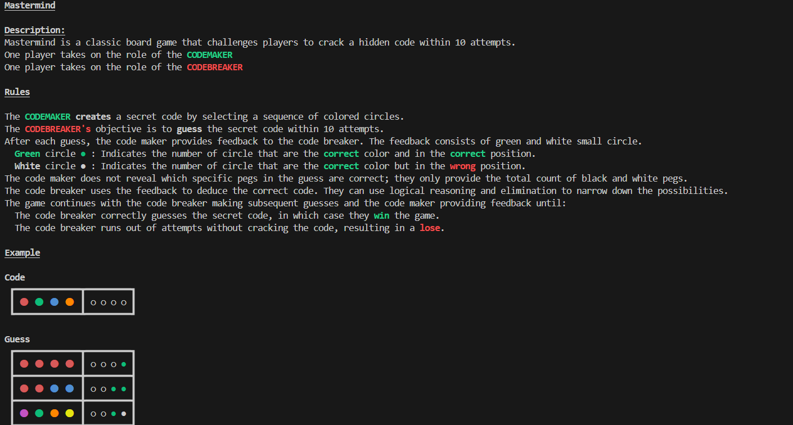

# Mastermind Game(Ruby)

A command-line Mastermind game written in Ruby. This project is part of [The Odin Project](https://www.theodinproject.com/lessons/ruby-mastermind) curriculum.

## Description

Mastermind is a classic board game where one player creates a secret code using colored pegs, and the other player tries to guess the code within a limited number of attempts. 
The code breaker receives feedback after each guess to help them narrow down the possibilities. The game involves logical thinking and deduction to crack the hidden code. It is
similar to wordle. In my implementation, I use the colors Red, Orange, Yellow, Green, Blue, Purple.

## Installation

### Windows

1. Ensure you have Ruby installed. If not, download and install it from [here](https://www.ruby-lang.org/en/downloads/).
2. Clone this repository to your local machine.
    ```bash
        git clone git@github.com:PeterG-ithub/ruby-mastermind.git
3. Navigate to the directory where you cloned the repository.
    ```bash
        cd ruby-mastermind
4. Run `main.rb` to start the game.
    ```bash
        ruby main.rb

### Linux

1. Open a terminal.
2. Ensure you have Ruby installed by running `ruby --version`. 
    ```bash
        ruby --version
If not, install Ruby using your package manager.
    ```bash
        sudo apt update
        sudo apt-get install ruby-full

3. Clone this repository to your local machine.
    ```bash
        git clone git@github.com:PeterG-ithub/ruby-mastermind.git
4. Navigate to the directory where you cloned the repository.
    ```bash
        cd ruby-mastermind
5. Run `main.rb` to start the game.
    ```bash
        ruby main.rb

## How to play
- To play Mastermind, one player creates a secret code using colored pegs, while the other player tries to guess the code. 
The code maker places a sequence of colored pegs in a specific order on the board, hiding it from the code breaker.

- The code breaker then makes their first guess by arranging their own set of colored pegs on the board. 
The code maker provides feedback by indicating how many pegs are the correct color and in the correct position (green pegs) 
and how many pegs are the correct color but in the wrong position (white pegs).

- Based on this feedback, the code breaker makes subsequent guesses, adjusting their strategy to deduce the secret code. 
The game continues until the code breaker correctly guesses the code or runs out of attempts.

- The challenge for the code breaker is to use logical reasoning and deduction to narrow down the possibilities and crack 
the code within the given number of turns. The code maker, on the other hand, aims to create a code that is difficult to decipher.

- The roles can be switched, allowing both players to experience being the code maker and code breaker. Mastermind can also 
be played solo, where the player tries to solve a code created by the game itself.

- In my implementation, the other player will be the computer while you get to choose if you want to be the code maker or the code breaker

- [Play here](https://replit.com/@Petahs/ruby-mastermind)
## Quick tutorial
For further explanation, You can watch this short youtube tutorial by [Gather Together Games](https://www.youtube.com/@GatherTogetherGames)\
[](https://youtu.be/Dn0iqlY5tMU)\
[How To Play Mastermind](https://youtu.be/Dn0iqlY5tMU)

## Swaszek Algorithm
In my codemaker mode, I use swaszek's algorithm to find the code. This algorithm implements a simple and computationally efficient strategy:
1. Create a list of all possible candidate secret codes from rrrr(red red red red) to pppp(purple purple purple purple).
2. Start the game by guessing rroo (red red orange orage).
3. Repeat the following steps until the secret code is found:
- Step 1: After receiving feedback, eliminate codes inconsistent with the feedback from the list of candidates.
- Step 2: Pick the first element from the updated list and use it as the new guess.
By applying this approach, we aim to efficiently find the secret code within a reduced number of attempts.

## Credits

This Ruby Project is part of the curriculum provided by [The Odin Project](https://www.theodinproject.com/), an open-source online platform that offers free resources to learn web development.
- Website: [The Odin Project](https://www.theodinproject.com/)
- Ruby Course: [Ruby](https://www.theodinproject.com/paths/full-stack-ruby-on-rails/courses/ruby)
- Mastermind Project: [Mastermind](https://www.theodinproject.com/lessons/ruby-mastermind)
- Mastermind tutorial: [How To Play Mastermind](https://youtu.be/Dn0iqlY5tMU)
- Swaszek algorithm info: [Wolfram](https://mathworld.wolfram.com/Mastermind.html)

## Screenshot demo


